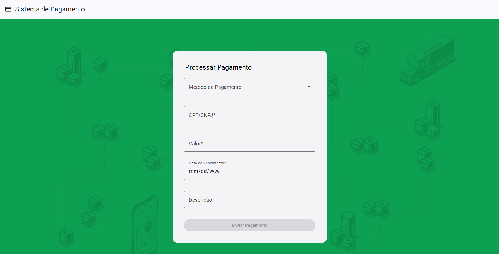

Aqui está a versão aprimorada do seu texto:  

---

# Pay Challenge Backend  

## Descrição  

O desafio consiste em desenvolver um sistema de processamento de pagamentos integrado ao ambiente de homologação do Asaas, utilizando **Node.js** para o backend. O sistema permitirá que o cliente acesse uma página simples e selecione a forma de pagamento desejada: **Boleto, Cartão ou Pix**.  

## Configuração do Projeto  

1. **Criar o arquivo `.env`**  
   - Use o arquivo `.env.example` como referência.  
   - Acesse a plataforma do **Asaas**, gere uma **API Key** e preencha as variáveis no arquivo `.env`:  

   ```ini
   PAY_API_KEY=YOUR_KEY
   PAY_BASE_URL=https://api-sandbox.asaas.com
   ```

2. **Instalar dependências**  

   ```bash
   npm install
   ```

3. **Compilar e executar o projeto**  

   ```bash
   npm run start
   ```

## Observação  

Para processar um pagamento, **pressupõe-se que o usuário já esteja cadastrado** na plataforma. Caso contrário, é necessário criá-lo antes de prosseguir.  

### Criando um usuário  

Para cadastrar um novo usuário, faça uma requisição **POST** para o seguinte endpoint:  

```http
POST https://api-sandbox.asaas.com/v3/customers
```

Com o seguinte payload:  

```json
{
  "cpfCnpj": "10687654896",
  "name": "John Doe",
  "email": "john.doe@example.com",
  "phone": "4738010919",
  "mobilePhone": "4799376637",
  "address": "Av. Paulista",
  "addressNumber": "150",
  "complement": "Sala 201",
  "province": "Centro",
  "postalCode": "01310-000"
}
```

Obs: Para chamar o endpoint do asaas é necessário passar o **access_token** que é o api-key gerado anteriomente.

Após criar o usuário, basta utilizar o **CPF** cadastrado para prosseguir com o processo de pagamento.  

  

## Frontend  

O código-fonte do **frontend** está disponível no repositório:  

🔗 [Payment Challenge Frontend](https://github.com/alanrps/payment-challenge-frontend)  


## Testes automatizados

Os testes automatizados foram apenas iniciados por conta do tempo, no entanto, é possível executá-los com o comando:

``` bash
npm run test
```

Para visualizar a cobertura dos testes, execute o seguinte comando:  

```bash
npm run test:cov
```

Isso exibirá as estatísticas diretamente no console. Além disso, uma pasta **coverage/lcov-report** será criada. Para uma visualização mais detalhada, abra o arquivo **index.html** dessa pasta em seu navegador.